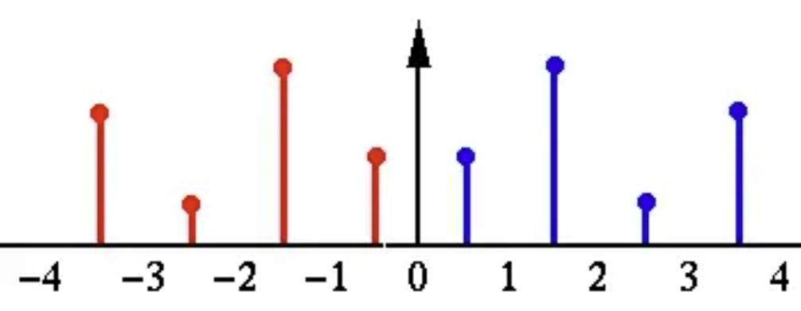
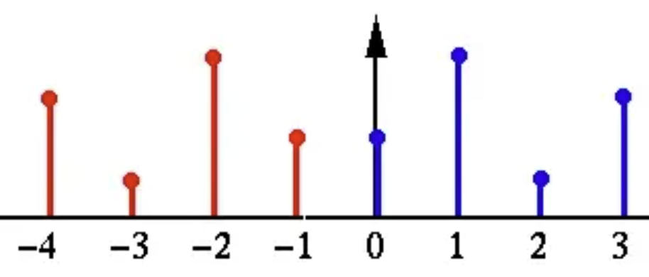

# torch_dct_expand_to_rectangle

# Headline News!!!!
This repository is a modified version of the original [torch_dct](https://github.com/zh217/torch-dct). The original code from the repository only supported discrete cosine transform (DCT) and inverse discrete cosine transform (IDCT) on square matrices. I have extended the functionality to support DCT and IDCT on matrices with unequal height and width, allowing for broader applicability in scenarios where non-square matrices are involved.


# DCT Principle

For a two-dimensional signal (such as an image) $f(x, y)$, its 2D Discrete Cosine Transform (DCT) can be expressed as:

$$
F(u, v) = \alpha(u) \alpha(v) \sum_{x=0}^{N-1} \sum_{y=0}^{M-1} f(x, y) \cos\left[\frac{\pi(2x + 1)u}{2N}\right] \cos\left[\frac{\pi(2y + 1)v}{2M}\right]
$$

where:
- $F(u, v)$ are the DCT coefficients in the frequency domain.
- $f(x, y)$ is the signal in the spatial domain (e.g., image pixel values).
- $N$ and $M$ are the width and height of the image, respectively.
- $\alpha(u)$ and $\alpha(v)$ are normalization factors defined as:

$$
\alpha(u) = 
\begin{cases}
\sqrt{\frac{1}{N}}, & \text{if } u = 0 \\
\sqrt{\frac{2}{N}}, & \text{if } u > 0
\end{cases}
$$

The DCT transforms the image from the spatial domain to the frequency domain. In the frequency representation, low-frequency components are concentrated in the top-left corner, while high-frequency components are distributed towards the bottom-right corner. A notable characteristic of DCT is its ability to concentrate most of the information in the low-frequency region, which is particularly useful in image compression.

The Inverse Discrete Cosine Transform (IDCT) is the inverse operation of DCT and is used to convert the signal from the frequency domain back to the spatial domain. Its mathematical formula is as follows:

$$
f(x, y) = \sum_{u=0}^{N-1} \sum_{v=0}^{M-1} \alpha(u) \alpha(v) F(u, v) \cos\left[\frac{\pi(2x + 1)u}{2N}\right] \cos\left[\frac{\pi(2y + 1)v}{2M}\right]
$$

The formula is very similar to DCT, but it operates on the frequency domain coefficients $F(u, v)$, converting them back to the spatial domain signal $f(x, y)$.

---

# Fast Calculation of 1D DCT Frequency Coefficients via FFT


Before diving into DCT transformation, let’s first take a look at the DFT transformation formula:

$$ 
X\left\lbrack k \right\rbrack = \sum_{n = 0}^{N - 1}{x\left\lbrack n \right\rbrack}\left( \cos\left( \frac{2\text{πkn}}{N} \right) - j\sin \left( \frac{2\text{πkn}}{N} \right) \right)\ 
$$

Of course, we can split the above equation into:

$$
X[k] = \sum_{n = 0}^{N - 1}{x[n]}\cos ( \frac{2\text{πkn}}{N} ) -j \sum_{n = 0}^{N - 1}{x[n]}{sin}( \frac{2{πkn}}{N})
$$

Clearly, the real part is handled by $\sum_{n = 0}^{N - 1}{x[n]}(\cos \frac{2\text{πkn}}{N})$, and the imaginary part is handled by $j \sum_{n = 0}^{N - 1}{x[n]}{sin}( \frac{2{πkn}}{N})$. Let’s define $cos (\frac{2\text{πkn}}{N}) = cos(kt)$, so we can summarize the equation as follows:

- Real part: $Re[k]=\sum_{n = 0}^{N - 1}{x[n]}cos(kt)$

- Imaginary part: $Im[k]=- \sum_{n = 0}^{N - 1}{x[n]}sin(kt)$

Obviously, since cosine is an even function and sine is an odd function, we get:

> When $x[n]$ is a real function, its real part in the frequency domain is an even function, while its imaginary part is an odd function.

---

Now, what happens if the original signal $x[n]$ is a real and even function? Clearly, since an even function multiplied by an even function is still an even function, and an odd function multiplied by an even function is still odd, we get: $x[n]sin(kt)$ becomes an odd function. Since it’s an odd function, naturally:

$$
Im[k]=-\sum_{n = 0}^{N - 1}{x[n]}sin(kt)=0
$$

As you can see, after the transformation, the imaginary part vanishes. Therefore, when the original time-domain signal is a real and even signal, we can rewrite the DFT as:

$$
X[k] = \sum_{n = 0}^{N - 1}{x[n]}(\cos \frac{2\text{πkn}}{N} ) 
$$

In fact, this is the core idea behind the DCT transformation. It’s quite simple, right? The DCT transformation is essentially a constrained form of the DFT transformation, and it’s not because the transformation method itself is different.

---

__But this isn’t quite enough yet!__

 You might notice that this still looks a bit different from the DCT formula you see in textbooks. Let’s take a look at the most commonly used DCT transformation formula:

$$
F(u)=c(u)\sum_{x=0}^{N-1}{f(x)cos\left[\frac{(x+0.5)\pi}{N}u\right]}
$$

Where, when $u=0$:

$$
c(0)=\sqrt{\frac{1}{N}}
$$

Otherwise:

$$
c(u)=\sqrt{\frac{2}{N}}
$$

If this is the first time you’ve seen the DCT transformation, you might be a bit confused. What’s going on here? We said that DCT is just a DFT transformation of a real and even input signal, right? Don’t worry, let me explain it in detail.

First of all, we need to reiterate that DCT is indeed a special case of the DFT transformation. That’s correct. The special part lies in the fact that the original signal is a real and even function. However, in real-world applications, we rarely have perfectly real and even signals to work with. So, to make it more broadly applicable, we construct an even signal from a real signal if the natural signal isn’t already even.

Given a discrete real signal of length $N$, $\{x[0], x[1], \dots, x[N-1]\}$, we first extend its length to twice the original, making it $2N$. We define the new signal $x^{'}[m]$ as:

$$
x^{'}[m]=x[m] \quad (0\leq m \leq N-1)
$$

$$
x^{'}[m]=x[-m-1] \quad (-N\leq m \leq -1)
$$

Simply speaking, the signal becomes as shown in the following figure:



The blue line represents the original signal, and the red line represents the extended signal.

This way, we’ve transformed a real signal into a real and even signal. Now, how do we write the DFT transformation for this extended signal? Clearly, the signal’s interval has now changed from $[0, N-1]$ to $[-N, N-1]$, so the DFT formula becomes:

$$
X[k]=\sum_{m=-N}^{N-1}{x^{'}[m]e^{\frac{-j2\pi mk}{2N}}} \quad \text{(Note that the length of the extended signal is now 2N)}
$$

However, extending the signal in this way introduces a problem: this signal is not symmetric around $m=0$, but around $m=-\frac{1}{2}$. Therefore, to make the signal symmetric about the origin, it’s a good idea to shift the entire extended signal by $\frac{1}{2}$ units to the right:



$$
X[k]=\sum_{m=-N+\frac{1}{2}}^{N-\frac{1}{2}}{x^{'}[m-\frac{1}{2}]e^{\frac{-j2\pi mk}{2N}}}
$$

Using Euler's formula and expanding the above equation, we only need the real part, as we have already discussed that the imaginary part becomes zero:

$$
X[k]=\sum_{m=-N+\frac{1}{2}}^{N-\frac{1}{2}}{x^{'}[m-\frac{1}{2}]cos\left(\frac{2\pi mk}{2N}\right)}
$$

At this point, it’s still not ideal, as $m$ turns out to be a fraction and can even be negative. Therefore, we need to further modify equation. Since we know that the sequence is an even-symmetric sequence, we can modify it as follows:

$$
\sum_{m=-N+\frac{1}{2}}^{N-\frac{1}{2}}{x^{'}[m-\frac{1}{2}]cos\left(\frac{2\pi mk}{2N}\right)} = 2*\sum_{m=\frac{1}{2}}^{N-\frac{1}{2}}{x^{'}[m-\frac{1}{2}]cos\left(\frac{2\pi mk}{2N}\right)}
$$

Next, let $n=m-\frac{1}{2}$ and substitute $n$ into the above equation:

$$
2*\sum_{n=0}^{N-1}{x^{'}[n]cos\left(\frac{2\pi (n+\frac{1}{2})k}{2N}\right)}=2*\sum_{n=0}^{N-1}{x^{'}[n]cos\left(\frac{(n+\frac{1}{2}) \pi k}{N}\right)}
$$

Now, we are very close to the standard DCT formula. The remaining issue is: what is that $c(u)$ term in the standard formula?

In the case of DCT, this term appears mainly to orthogonalize the matrix when the DCT transformation is represented in matrix form, making further computation easier. In this case, the coefficient should be set to $\sqrt{\frac{1}{2N}}$ (except when $k=0$, which requires separate consideration; for a detailed derivation, refer to the reference).

Multiplying this coefficient into the above equation: $\sqrt{\frac{2}{N}}*\sum_{n=0}^{N-1}{x^{'}[n]cos({\frac{(n+\frac{1}{2}) \pi k}{N}})}$

$$
\sqrt{\frac{1}{2N}}*2*\sum_{n=0}^{N-1}{x^{'}[n]cos({\frac{(n+\frac{1}{2}) \pi k}{N}})}=\sqrt{\frac{2}{N}}*\sum_{n=0}^{N-1}{x^{'}[n]cos({\frac{(n+\frac{1}{2}) \pi k}{N}})}
$$

# Generating the DCT Matrix

An ingenious operation is to apply the `dct` function on an identity matrix, which yields the DCT matrix.

<span style="background:#fff88f">Here's a specific example:</span>

Below is an example of a $4 \times 4$ DCT matrix for better understanding:

$$
D = \sqrt{\frac{2}{4}} \begin{bmatrix} 
\frac{1}{\sqrt{2}} & \cos\left(\frac{\pi}{8}\right) & \cos\left(\frac{2\pi}{8}\right) & \cos\left(\frac{3\pi}{8}\right) \\ 
\frac{1}{\sqrt{2}} & \cos\left(\frac{3\pi}{8}\right) & \cos\left(\frac{6\pi}{8}\right) & \cos\left(\frac{9\pi}{8}\right) \\ 
\frac{1}{\sqrt{2}} & \cos\left(\frac{5\pi}{8}\right) & \cos\left(\frac{10\pi}{8}\right) & \cos\left(\frac{15\pi}{8}\right) \\ 
\frac{1}{\sqrt{2}} & \cos\left(\frac{7\pi}{8}\right) & \cos\left(\frac{14\pi}{8}\right) & \cos\left(\frac{21\pi}{8}\right) 
\end{bmatrix}
$$

Applying DCT function to a $4 \times 4$ identity matrix results in a DCT matrix $D$. We construct this matrix row by row according to the DCT definition.

For a 1D signal $x$ of length $N$, the $k$-th DCT coefficient is defined as:

$$
X_k = \alpha_k \sum_{n=0}^{N-1} x_n \cos\left(\frac{\pi}{N} \left(n + \frac{1}{2}\right) k\right),
$$

<span style="background:#fff88f">Taking the 0th row as an example:</span>

$$
D_{0,k} = \alpha_k \sum_{n=0}^{N-1} x_n \cos\left(\frac{(2n+1)\pi}{2N} \cdot k\right)
$$

$$
= \alpha_k \cdot x_0 \cos\left(\frac{\pi}{2N} \cdot k\right) = \alpha_k \cos\left(\frac{\pi}{8} \cdot k\right)
$$

Therefore:

$$
D_{0,0} = \alpha_0 = \sqrt{\frac{1}{4}}
$$

$$
D_{0,1} = \alpha_1 \cos\left(\frac{\pi}{8}\right)
$$

$$
D_{0,2} = \alpha_2 \cos\left(\frac{2\pi}{8}\right)
$$

$$
D_{0,3} = \alpha_3 \cos\left(\frac{3\pi}{8}\right)
$$


# Using the DCT Matrix to Perform 2D Discrete Cosine Transform


# Inverse DCT Transform

To understand the `idct` function, it is essential to first establish a key conclusion:

> For a real sequence $x[n]$, its frequency domain representation $X[k]$ exhibits conjugate symmetry:

$$
X[N - k] = \overline{X[k]},
$$

__Here is the proof of this conclusion:__

The Discrete Fourier Transform (DFT) converts a time-domain signal $x[n]$ into its frequency-domain representation $X[k]$, defined as:

$$
X[k] = \sum_{n=0}^{N-1} x[n] e^{-j \frac{2\pi k n}{N}}.
$$

According to the DFT definition, by replacing $k$ with $N - k$:

$$
X[N - k] = \sum_{n=0}^{N-1} x[n] e^{-j \frac{2\pi (N - k) n}{N}}.
$$

Simplifying the exponential part:

$$
e^{-j \frac{2\pi (N - k) n}{N}} = e^{-j \frac{2\pi N n}{N}} \cdot e^{j \frac{2\pi k n}{N}}.
$$

Since $e^{-j \frac{2\pi N n}{N}} = e^{-j 2\pi n} = 1$ (as $e^{-j 2\pi n}$ represents a full cycle rotation):

$$
e^{-j \frac{2\pi (N - k) n}{N}} = e^{j \frac{2\pi k n}{N}}.
$$

Thus, $X[N - k]$ becomes:

$$
X[N - k] = \sum_{n=0}^{N-1} x[n] e^{j \frac{2\pi k n}{N}}.
$$

Consider the complex conjugate of $X[k]$, $\overline{X[k]}$:

$$
\overline{X[k]} = \overline{\sum_{n=0}^{N-1} x[n] e^{-j \frac{2\pi k n}{N}}}.
$$

Using the linearity of complex conjugation:

$$
\overline{X[k]} = \sum_{n=0}^{N-1} \overline{x[n]} \cdot \overline{e^{-j \frac{2\pi k n}{N}}}.
$$

Since $x[n]$ is real, $\overline{x[n]} = x[n]$, and $\overline{e^{-j \frac{2\pi k n}{N}}} = e^{j \frac{2\pi k n}{N}}$, therefore:

$$
\bar{X[k]} = \sum_{n=0}^{N-1} \bar{x[n]} \cdot \overline{e^{-j \frac{2\pi k n}{N}}}.
$$

Comparing $X[N - k]$ and $\overline{X[k]}$ yields:

$$
X[N - k] = \overline{X[k]}.
$$

<span style="background:#fff88f">This conclusion indicates that the frequency domain representation of a real sequence exhibits conjugate symmetry, meaning that the Fourier transform of a real sequence is symmetric about the midpoint, with opposite signs for the imaginary part.</span>

Understanding this conclusion clarifies why the code operates as follows:

```python
V_t_r = X_v
# Note: here 't' stands for temporal
V_t_i = torch.cat([X_v[:, :1] * 0, -X_v.flip([1])[:, :-1]], dim=1)
```

Note: Since torch.fft.irfft only handles the first half of the frequency domain, this operation is actually valid.


# Principle of `torch.fft.irfft`

To understand the function's principle, we start with the standard inverse Fourier transform formula and utilize frequency-domain conjugate symmetry.

The standard inverse discrete Fourier transform formula is:

$$
x[n] = \frac{1}{N} \sum_{k=0}^{N-1} X[k] e^{j \frac{2\pi k n}{N}},
$$

For a real sequence $x[n]$, its discrete Fourier transform $X[k]$ satisfies the following conjugate symmetry:

$$
X[N - k] = \overline{X[k]}.
$$

<span style="background:#fff88f">Conjugate symmetry implies that the first half of the frequency domain contains all the information, while the second half is a mirror image of the first half. This property allows us to compute only the first half of the frequency data (i.e., from $k = 0$ to $\frac{N}{2}$) and then use symmetry to reconstruct the complete signal.</span>

Using conjugate symmetry, the inverse Fourier transform formula can be split into the symmetric first half and the second half:

$$
x[n] = \frac{1}{N} \sum_{k=0}^{\frac{N}{2}} X[k] e^{j \frac{2\pi k n}{N}} + \frac{1}{N} \sum_{k=\frac{N}{2}+1}^{N-1} X[k] e^{j \frac{2\pi k n}{N}}.
$$

Using symmetry, the sum of the second half can be rewritten as the conjugate of the first half:

$$
\sum_{k=\frac{N}{2}+1}^{N-1} X[k] e^{j \frac{2\pi k n}{N}} = \sum_{k=1}^{\frac{N}{2}-1} \overline{X[k]} e^{j \frac{2\pi (N-k) n}{N}}.
$$

We know that:

$$
e^{j \frac{2\pi (N-k) n}{N}} = e^{j 2\pi n} \cdot e^{-j \frac{2\pi k n}{N}} = e^{-j \frac{2\pi k n}{N}},
$$

since $e^{j 2\pi n} = 1$. Therefore:

$$
\sum_{k=\frac{N}{2}+1}^{N-1} X[k] e^{j \frac{2\pi k n}{N}} = \sum_{k=1}^{\frac{N}{2}-1} \overline{X[k]} e^{-j \frac{2\pi k n}{N}}
$$

Substituting the above expression into the original formula:

$$
x[n] = \frac{1}{N} \left( X[0] + X\left(\frac{N}{2}\right)(-1)^n + \sum_{k=1}^{\frac{N}{2}-1} \left(X[k] e^{j \frac{2\pi k n}{N}} + \overline{X[k]} e^{-j \frac{2\pi k n}{N}}\right) \right)
$$


Notice that $X[k] e^{j \frac{2\pi k n}{N}} + \overline{X[k]} e^{-j \frac{2\pi k n}{N}}$ is in real form:

$$
X[k] e^{j \frac{2\pi k n}{N}} + \overline{X[k]} e^{-j \frac{2\pi k n}{N}} = 2 \cdot \text{Re}\left(X[k] e^{j \frac{2\pi k n}{N}}\right)
$$

Therefore, the final inverse transform formula is:

$$
x[n] = \frac{1}{N} \left( X[0] + \sum_{k=1}^{\frac{N}{2}-1} 2 \cdot \text{Re}\left(X[k] e^{j \frac{2\pi k n}{N}}\right) + X\left(\frac{N}{2}\right)(-1)^n \right)
$$
