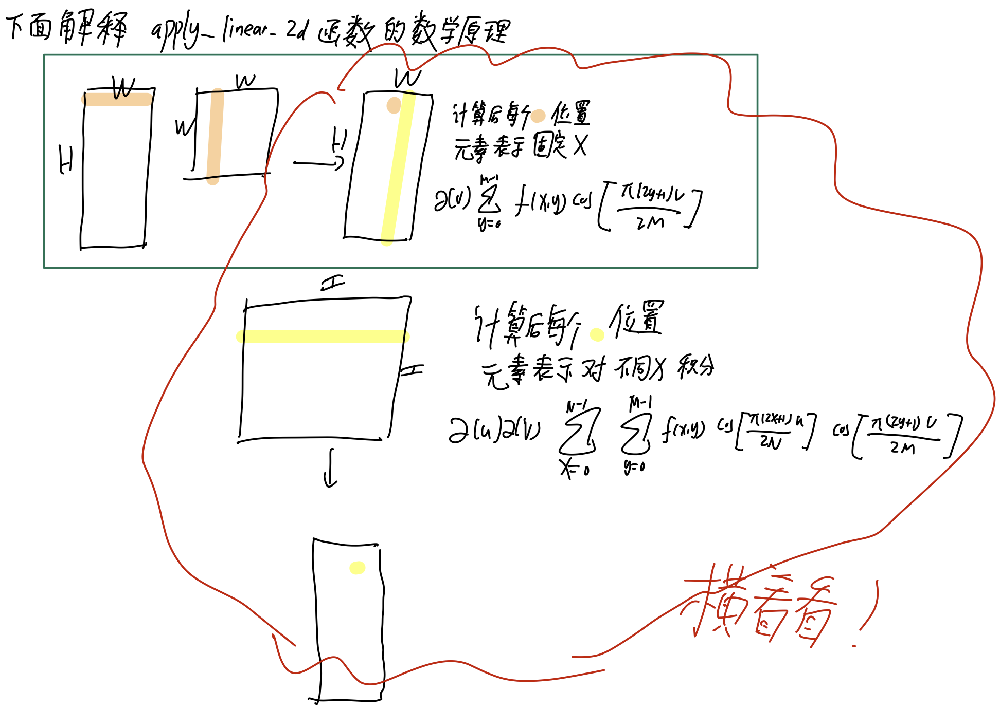

# torch_dct_expand_to_rectangle

# Headline News!!!!
This repository is a modified version of the original [torch_dct](https://github.com/zh217/torch-dct). The original code from the repository only supported discrete cosine transform (DCT) and inverse discrete cosine transform (IDCT) on square matrices. I have extended the functionality to support DCT and IDCT on matrices with unequal height and width, allowing for broader applicability in scenarios where non-square matrices are involved.


# DCT Principle

For a two-dimensional signal (such as an image) $f(x, y)$, its 2D Discrete Cosine Transform (DCT) can be expressed as:

$$
F(u, v) = \alpha(u) \alpha(v) \sum_{x=0}^{N-1} \sum_{y=0}^{M-1} f(x, y) \cos\left[\frac{\pi(2x + 1)u}{2N}\right] \cos\left[\frac{\pi(2y + 1)v}{2M}\right]
$$

where:
- $F(u, v)$ are the DCT coefficients in the frequency domain.
- $f(x, y)$ is the signal in the spatial domain (e.g., image pixel values).
- $N$ and $M$ are the width and height of the image, respectively.
- $\alpha(u)$ and $\alpha(v)$ are normalization factors defined as:

$$
\alpha(u) = 
\begin{cases}
\sqrt{\frac{1}{N}}, & \text{if } u = 0 \\
\sqrt{\frac{2}{N}}, & \text{if } u > 0
\end{cases}
$$

The DCT transforms the image from the spatial domain to the frequency domain. In the frequency representation, low-frequency components are concentrated in the top-left corner, while high-frequency components are distributed towards the bottom-right corner. A notable characteristic of DCT is its ability to concentrate most of the information in the low-frequency region, which is particularly useful in image compression.

The Inverse Discrete Cosine Transform (IDCT) is the inverse operation of DCT and is used to convert the signal from the frequency domain back to the spatial domain. Its mathematical formula is as follows:

$$
f(x, y) = \sum_{u=0}^{N-1} \sum_{v=0}^{M-1} \alpha(u) \alpha(v) F(u, v) \cos\left[\frac{\pi(2x + 1)u}{2N}\right] \cos\left[\frac{\pi(2y + 1)v}{2M}\right]
$$

The formula is very similar to DCT, but it operates on the frequency domain coefficients $F(u, v)$, converting them back to the spatial domain signal $f(x, y)$.

---

# Fast Calculation of 1D DCT Frequency Coefficients via FFT

To convert DCT using FFT, we first perform symmetry operations on the signal. The key is to rearrange the signal's odd and even components to form a special symmetric signal.

Let the input signal $x$ have a length of $N$. We rearrange and flip the signal to form a new signal $v$, also of length $N$, defined as follows:

$$
v = [x_0, x_2, \ldots, x_{N-2}, x_{N-1}, x_{N-3}, \ldots, x_1]
$$

Where:

- $[x_0, x_2, \ldots, x_{N-2}]$ are the elements at even indices of the signal.
- $[x_{N-1}, x_{N-3}, \ldots, x_1]$ are the reversed elements at odd indices of the signal.

This rearrangement symmetrically structures the original signal to create components that correspond to the cosine elements in Fourier transforms (<span style="background:#fff88f">Don't be worry, I will show this later!</span>).

FFT (Fast Fourier Transform) is a fast algorithm for computing the Discrete Fourier Transform (DFT), given by:

$$
V_k = \sum_{n=0}^{N-1} v_n e^{-i \frac{2\pi nk}{N}}, \quad k = 0, 1, \ldots, N-1
$$

Using Euler's formula $e^{-i\theta} = \cos(\theta) - i\sin(\theta)$, the formula can be decomposed into:

$$
V_k = \sum_{n=0}^{N-1} v_n \left[\cos\left(\frac{2\pi nk}{N}\right) - i\sin\left(\frac{2\pi nk}{N}\right)\right]
$$

The FFT result is a complex number containing a real part (cosine term) and an imaginary part (sine term).

**Real Part:**

$$
\text{Re}(V_k) = \sum_{n=0}^{N-1} v_n \cos\left(\frac{2\pi nk}{N}\right)
$$

**Imaginary Part:**

$$
\text{Im}(V_k) = -\sum_{n=0}^{N-1} v_n \sin\left(\frac{2\pi nk}{N}\right)
$$

----

A crucial part of understanding this function lies in the following lines of code:

```python
    k = -torch.arange(N, dtype=x.dtype, device=x.device)[None, :] * np.pi / (2 * N)
    W_r = torch.cos(k)
    W_i = torch.sin(k)

    V = Vc[:, :, 0] * W_r - Vc[:, :, 1] * W_i
```

According to the definition: DCT is a transformation that converts the input signal into cosine basis frequency components, mathematically defined as:

$$
V_k = \sum_{n=0}^{N-1} x_n \cos\left(\frac{\pi (2n + 1) k}{2N}\right), \quad k = 0, 1, \ldots, N-1
$$

__Statement__:

$$
V_k = \text{Vc[:, :, 0]} \cdot W_r - \text{Vc[:, :, 1]} \cdot W_i
$$

__Proof__: The right side of the equation equals:

$$
= \sum_{n=0}^{N-1} x_n \cos\left(\frac{2\pi nk}{2N}\right) \cos\left(-\frac{k\pi}{2N}\right) - \left(-\sum_{n=0}^{N-1} x_n \sin\left(\frac{2\pi nk}{2N}\right)\right) \sin\left(-\frac{\pi k}{2N}\right)
$$

$$
= \sum_{n=0}^{N-1} x_n \left[\cos\left(\frac{2\pi nk}{2N}\right) \cos\left(-\frac{k\pi}{2N}\right) + \sin\left(\frac{2\pi nk}{2N}\right) \sin\left(-\frac{\pi k}{2N}\right)\right]
$$

Using the formulas:

$$
\cos(\alpha + \beta) = \cos\alpha \cos\beta - \sin\alpha \sin\beta
$$

$$
\cos(\alpha - \beta) = \cos \alpha \cos\beta + \sin\alpha \sin\beta
$$

$$
= \sum_{n=0}^{N-1} x_n \cos\left(\frac{\pi (2n + 1) k}{2N}\right)
$$

# Generating the DCT Matrix

An ingenious operation is to apply the `dct` function on an identity matrix, which yields the DCT matrix.

<span style="background:#fff88f">Here's a specific example:</span>

Below is an example of a $4 \times 4$ DCT matrix for better understanding:

$$
D = \sqrt{\frac{2}{4}} \begin{bmatrix} 
\frac{1}{\sqrt{2}} & \cos\left(\frac{\pi}{8}\right) & \cos\left(\frac{2\pi}{8}\right) & \cos\left(\frac{3\pi}{8}\right) \\ 
\frac{1}{\sqrt{2}} & \cos\left(\frac{3\pi}{8}\right) & \cos\left(\frac{6\pi}{8}\right) & \cos\left(\frac{9\pi}{8}\right) \\ 
\frac{1}{\sqrt{2}} & \cos\left(\frac{5\pi}{8}\right) & \cos\left(\frac{10\pi}{8}\right) & \cos\left(\frac{15\pi}{8}\right) \\ 
\frac{1}{\sqrt{2}} & \cos\left(\frac{7\pi}{8}\right) & \cos\left(\frac{14\pi}{8}\right) & \cos\left(\frac{21\pi}{8}\right) 
\end{bmatrix}
$$

Applying DCT function to a $4 \times 4$ identity matrix results in a DCT matrix $D$. We construct this matrix row by row according to the DCT definition.

For a 1D signal $x$ of length $N$, the $k$-th DCT coefficient is defined as:

$$
X_k = \alpha_k \sum_{n=0}^{N-1} x_n \cos\left(\frac{\pi}{N} \left(n + \frac{1}{2}\right) k\right),
$$

<span style="background:#fff88f">Taking the 0th row as an example:</span>

$$
D_{0,k} = \alpha_k \sum_{n=0}^{N-1} x_n \cos\left(\frac{(2n+1)\pi}{2N} \cdot k\right)
$$

$$
= \alpha_k \cdot x_0 \cos\left(\frac{\pi}{2N} \cdot k\right) = \alpha_k \cos\left(\frac{\pi}{8} \cdot k\right)
$$

Therefore:

$$
D_{0,0} = \alpha_0 = \sqrt{\frac{1}{4}}
$$

$$
D_{0,1} = \alpha_1 \cos\left(\frac{\pi}{8}\right)
$$

$$
D_{0,2} = \alpha_2 \cos\left(\frac{2\pi}{8}\right)
$$

$$
D_{0,3} = \alpha_3 \cos\left(\frac{3\pi}{8}\right)
$$


# Using the DCT Matrix to Perform 2D Discrete Cosine Transform


# Inverse DCT Transform

To understand the `idct` function, it is essential to first establish a key conclusion:

> For a real sequence $x[n]$, its frequency domain representation $X[k]$ exhibits conjugate symmetry:

$$
X[N - k] = \overline{X[k]},
$$

__Here is the proof of this conclusion:__

The Discrete Fourier Transform (DFT) converts a time-domain signal $x[n]$ into its frequency-domain representation $X[k]$, defined as:

$$
X[k] = \sum_{n=0}^{N-1} x[n] e^{-j \frac{2\pi k n}{N}}.
$$

According to the DFT definition, by replacing $k$ with $N - k$:

$$
X[N - k] = \sum_{n=0}^{N-1} x[n] e^{-j \frac{2\pi (N - k) n}{N}}.
$$

Simplifying the exponential part:

$$
e^{-j \frac{2\pi (N - k) n}{N}} = e^{-j \frac{2\pi N n}{N}} \cdot e^{j \frac{2\pi k n}{N}}.
$$

Since $e^{-j \frac{2\pi N n}{N}} = e^{-j 2\pi n} = 1$ (as $e^{-j 2\pi n}$ represents a full cycle rotation):

$$
e^{-j \frac{2\pi (N - k) n}{N}} = e^{j \frac{2\pi k n}{N}}.
$$

Thus, $X[N - k]$ becomes:

$$
X[N - k] = \sum_{n=0}^{N-1} x[n] e^{j \frac{2\pi k n}{N}}.
$$

Consider the complex conjugate of $X[k]$, $\overline{X[k]}$:

$$
\overline{X[k]} = \overline{\sum_{n=0}^{N-1} x[n] e^{-j \frac{2\pi k n}{N}}}.
$$

Using the linearity of complex conjugation:

$$
\overline{X[k]} = \sum_{n=0}^{N-1} \overline{x[n]} \cdot \overline{e^{-j \frac{2\pi k n}{N}}}.
$$

Since $x[n]$ is real, $\overline{x[n]} = x[n]$, and $\overline{e^{-j \frac{2\pi k n}{N}}} = e^{j \frac{2\pi k n}{N}}$, therefore:

$$
\bar{X[k]} = \sum_{n=0}^{N-1} \bar{x[n]} \cdot \overline{e^{-j \frac{2\pi k n}{N}}}.
$$

Comparing $X[N - k]$ and $\overline{X[k]}$ yields:

$$
X[N - k] = \overline{X[k]}.
$$

<span style="background:#fff88f">This conclusion indicates that the frequency domain representation of a real sequence exhibits conjugate symmetry, meaning that the Fourier transform of a real sequence is symmetric about the midpoint, with opposite signs for the imaginary part.</span>

Understanding this conclusion clarifies why the code operates as follows:

```python
V_t_r = X_v
# Note: here 't' stands for temporal
V_t_i = torch.cat([X_v[:, :1] * 0, -X_v.flip([1])[:, :-1]], dim=1)
```

Note: Since torch.fft.irfft only handles the first half of the frequency domain, this operation is actually valid.


# Principle of `torch.fft.irfft`

To understand the function's principle, we start with the standard inverse Fourier transform formula and utilize frequency-domain conjugate symmetry.

The standard inverse discrete Fourier transform formula is:

$$
x[n] = \frac{1}{N} \sum_{k=0}^{N-1} X[k] e^{j \frac{2\pi k n}{N}},
$$

For a real sequence $x[n]$, its discrete Fourier transform $X[k]$ satisfies the following conjugate symmetry:

$$
X[N - k] = \overline{X[k]}.
$$

<span style="background:#fff88f">Conjugate symmetry implies that the first half of the frequency domain contains all the information, while the second half is a mirror image of the first half. This property allows us to compute only the first half of the frequency data (i.e., from $k = 0$ to $\frac{N}{2}$) and then use symmetry to reconstruct the complete signal.</span>

Using conjugate symmetry, the inverse Fourier transform formula can be split into the symmetric first half and the second half:

$$
x[n] = \frac{1}{N} \sum_{k=0}^{\frac{N}{2}} X[k] e^{j \frac{2\pi k n}{N}} + \frac{1}{N} \sum_{k=\frac{N}{2}+1}^{N-1} X[k] e^{j \frac{2\pi k n}{N}}.
$$

Using symmetry, the sum of the second half can be rewritten as the conjugate of the first half:

$$
\sum_{k=\frac{N}{2}+1}^{N-1} X[k] e^{j \frac{2\pi k n}{N}} = \sum_{k=1}^{\frac{N}{2}-1} \overline{X[k]} e^{j \frac{2\pi (N-k) n}{N}}.
$$

We know that:

$$
e^{j \frac{2\pi (N-k) n}{N}} = e^{j 2\pi n} \cdot e^{-j \frac{2\pi k n}{N}} = e^{-j \frac{2\pi k n}{N}},
$$

since $e^{j 2\pi n} = 1$. Therefore:

$$
\sum_{k=\frac{N}{2}+1}^{N-1} X[k] e^{j \frac{2\pi k n}{N}} = \sum_{k=1}^{\frac{N}{2}-1} \overline{X[k]} e^{-j \frac{2\pi k n}{N}}
$$

Substituting the above expression into the original formula:

$$
x[n] = \frac{1}{N} \left( X[0] + X\left(\frac{N}{2}\right)(-1)^n + \sum_{k=1}^{\frac{N}{2}-1} \left(X[k] e^{j \frac{2\pi k n}{N}} + \overline{X[k]} e^{-j \frac{2\pi k n}{N}}\right) \right)
$$


Notice that $X[k] e^{j \frac{2\pi k n}{N}} + \overline{X[k]} e^{-j \frac{2\pi k n}{N}}$ is in real form:

$$
X[k] e^{j \frac{2\pi k n}{N}} + \overline{X[k]} e^{-j \frac{2\pi k n}{N}} = 2 \cdot \text{Re}\left(X[k] e^{j \frac{2\pi k n}{N}}\right)
$$

Therefore, the final inverse transform formula is:

$$
x[n] = \frac{1}{N} \left( X[0] + \sum_{k=1}^{\frac{N}{2}-1} 2 \cdot \text{Re}\left(X[k] e^{j \frac{2\pi k n}{N}}\right) + X\left(\frac{N}{2}\right)(-1)^n \right)
$$
